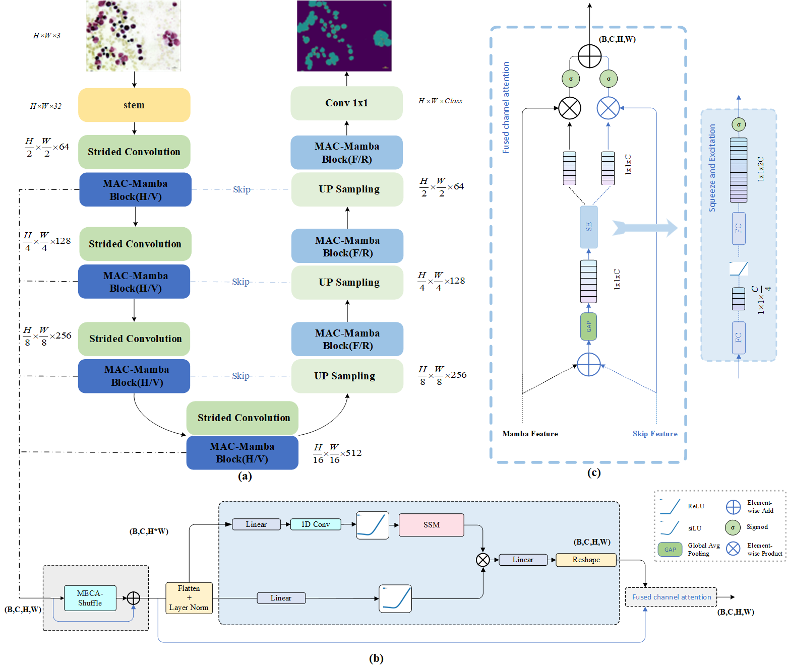
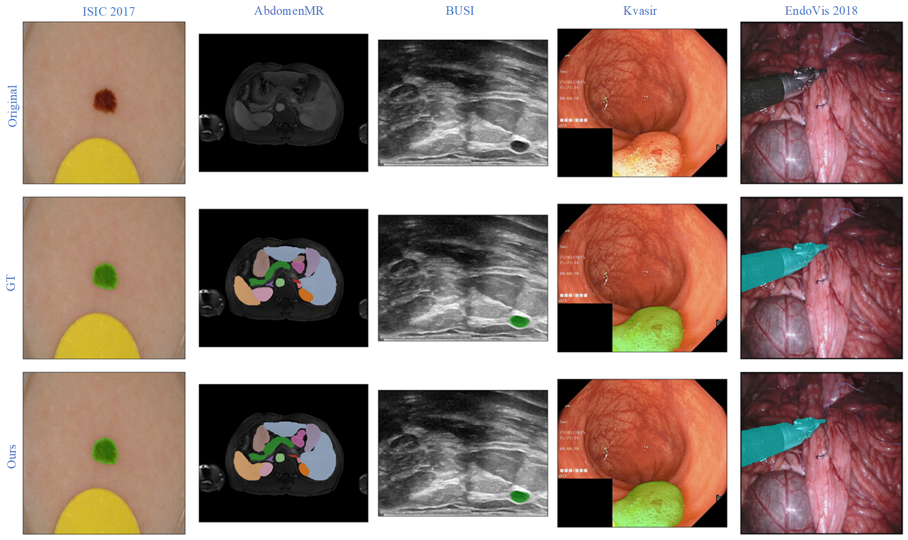
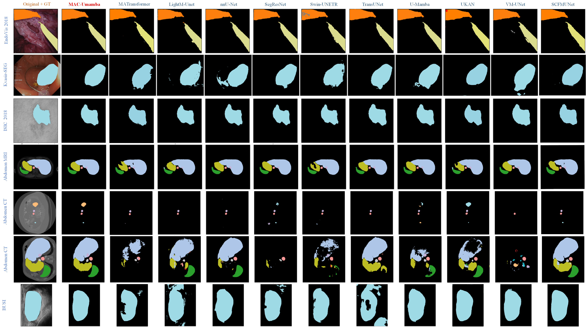

# Mac-UMamba

Official implementation of **MAC-UMamba: Multi-scale Asymmetric Channel-calibrated Hybrid Architecture for Generalizable Biomedical Segmentation**.

The implementation contains the MAC-UMamba network and its nnU-Net v2 training integration. The model code is in `umamba/nnunetv2/nets/MACUmamba.py`, with the trainer entry point in `umamba/nnunetv2/training/nnUNetTrainer/nnUNetTrainerMACUmamba.py`.

## Quick start

### 1. Install

The commands below assume a Python 3.10 environment and a CUDA-capable system. The `mamba-ssm` dependency may require a compatible CUDA and PyTorch toolchain.

```bash
conda create -n macumamba python=3.10 -y
conda activate macumamba
pip install -r requirements.txt
pip install -e ./umamba
```

### 2. Prepare the data

Place the downloaded datasets under `data/nnUNet_raw/` using the dataset folders and `dataset.json` files included in this repository. The paper experiments use the 2D configuration.

| ID | Dataset |
|---:|---|
| 701 | AbdomenCT |
| 702 | AbdomenMR |
| 703 | ISIC 2017 |
| 704 | ISIC 2018 |
| 705 | PH2 (external test set) |
| 706 | BUSI |
| 707 | Kvasir |
| 708 | EndoVis 2018 |
| 801 | EndoVis 2017 |

### 3. Plan and preprocess

For example, to prepare ISIC 2017:

```bash
nnUNetv2_plan_and_preprocess -d 703 --verify_dataset_integrity -c 2d
```

### 4. Train

Train one fold with the MAC-UMamba trainer:

```bash
nnUNetv2_train Dataset703_isic2017 2d 0 \
  -tr nnUNetTrainerMACUmamba -p nnUNetPlans -device cuda
```

Train all five cross-validation folds:

```bash
for fold in 0 1 2 3 4; do
  nnUNetv2_train Dataset703_isic2017 2d $fold \
    -tr nnUNetTrainerMACUmamba -p nnUNetPlans -device cuda
done
```

Use `CUDA_VISIBLE_DEVICES=0` to select a GPU. The trainer also accepts `-device mps` where the installed dependencies support Apple Silicon.

### 5. Predict

Input files must follow nnU-Net naming, for example `case_0000.png` for a single-channel input. Use the same dataset configuration and trainer used during training:

```bash
nnUNetv2_predict \
  -d Dataset703_isic2017 \
  -i /path/to/imagesTs \
  -o /path/to/predictions \
  -tr nnUNetTrainerMACUmamba -p nnUNetPlans -c 2d \
  -f 0 1 2 3 4 -device cuda
```

For a single trained fold, replace `-f 0 1 2 3 4` with `-f 0`. The output folder is created automatically.

## Paper figures

The main architecture, qualitative comparison, generalization, ablation, efficiency and analysis figures from the revised manuscript are available in [`docs/figures/`](docs/figures/). Selected previews:







See the [complete figure list and captions](docs/figures/README.md).

The repository includes dataset metadata and conversion utilities only. Raw datasets, trained weights, experiment outputs, the manuscript source and IDE files are intentionally excluded.

## Repository migration

The original GitHub account is no longer available. The previous repository URL was [Corazon12138/MACU-Mamba-main](https://github.com/Corazon12138/MACU-Mamba-main). This repository is the migrated and maintained location for MAC-UMamba; please use it for future downloads, issues and updates.

## Citation

If this paper is helpful to your research, please cite it:

DOI: [10.1016/j.eswa.2026.132606](https://doi.org/10.1016/j.eswa.2026.132606)

```bibtex
@article{ZHANG2026132606,
  title = {MAC-UMamba: multi-scale asymmetric channel-calibrated hybrid architecture for generalizable biomedical segmentation},
  journal = {Expert Systems with Applications},
  volume = {325},
  pages = {132606},
  year = {2026},
  issn = {0957-4174},
  doi = {10.1016/j.eswa.2026.132606},
  url = {https://www.sciencedirect.com/science/article/pii/S0957417426015198},
  author = {Enbao Zhang and Hui Shen and Nana Bao and Dandan Chen},
  keywords = {Mamba architecture, Multi-scale feature extraction, Dynamic channel calibration, Asymmetric scanning}
}
```
